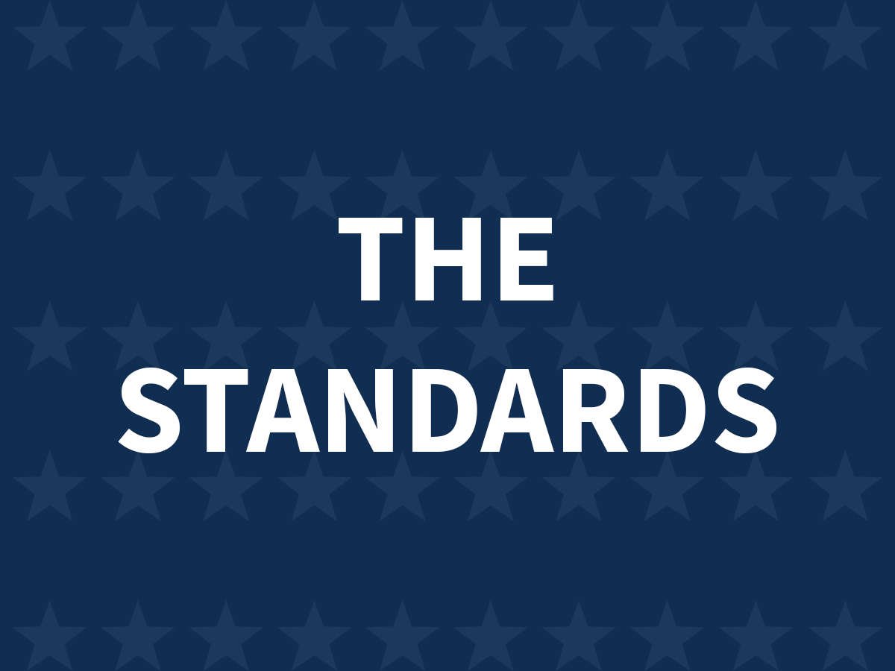

The Standards
=======================

The Standards is a flexible WordPess theme built with Automattic's underscores theme and the [US Web Design System](https://designsystem.digital.gov/).  

For additional features, install the The Standards Companion plugin (COMING SOON!), [The Standards Companion](https://github.com/LavertyCreative/), that came with the The Standards theme.
 

## Features

#### Customizer options:
* Colors
* Site logo
* Social media profiles
* Header layout
* Front page main content layout
* Footer layout
* Global header image (for interior pages, posts, and standard WordPress templates)
* Copyright message

#### Widgets:
* Sidebar
* Hero
* Front Page 1
* Front Page 2
* Front Page 3
* Footer Big Widget

### Additional Components
These components are NOT included in the theme by default, but are available in the The Standards Companion plugin, [The Standards Companion](https://github.com/LavertyCreative/).

Here is a list of the currently available components in [The Standards Companion](https://github.com/LavertyCreative/):
* Coming soon
